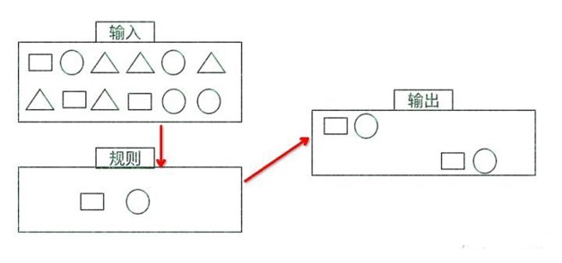
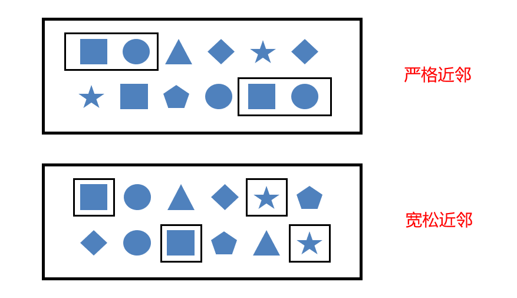

### 1.CEP简介
#### 1.1 基本概念
复杂事件处理(Complex Event Processing)
CEP允许在无休止的时间流中检测事件模式，让我们有机会掌握数据中的重要部分，一个或多个由简单事件构成的时间流通过一定的规则匹配，然后输出满足规则的复杂事件。

#### 1.2 特点


**目标**
从有序的简单事件流中发现一些高阶特征
**输入**
一个或多个由简单事件构成的时间流
**处理**
识别简单事件之间的内在联系，多个符合一定规则的简单事件构成复杂事件
**输出**
满足规则的复杂事件


### 2.Pattern API
**模式**就是处理事件的规则
Flink提供了Pattern API用于对输入流数据进行复杂事件规则定义，用来提取符合规则的时间序列
```scala
//define a pattern
val pattern = Pattern.begin[Event]("start").where(_.getId == 42)
    .next("middle").subtype(classOf[SubEvent]).where(_.getTemp >= 10.0)
    .followedBy("end").where(_.getName == "end")
//apply pattern to stream
val patternStream = CEP.pattern(inputDataStream, pattern)
//get event sequence, then get processing result
val result: DataStream[Alert] = patternStream.select(createAlert(_))
```

 * **个体模式(Individual Patterns)**
组成复杂规则的每一个单独的模式定义，就是"个体模式"
```scala
start.times(3).where(_.behavior.startsWith("fav"))
```

 * **组合模式(Combining Patterns)**
很多个体模式组合起来，就形成了整个的模式序列(组合模式)
模式序列必须以一个"初始模式"开始
```scala
val start = Pattern.begin("start")
```

 * **模式组(Group of Patterns)**
将一个模式序列作为条件嵌套在个体模式里，成为一组模式

#### 2.1 个体模式
 * 个体模式可以包括"单例(singleton)模式"和"循环(looping)模式"
 * 单例模式只接收一个事件，而循环模式可以接收多个

**量词(Quantifier)**
 * 可以在一个个体模式后追加量词，也就是指定循环次数

```scala
//匹配出现4次
start.times(4)
//匹配出现0或4次
start.times(4).optional
//匹配出现2,3或者4次
start.times(2,4)
//匹配出现2,3或者4次，并且尽可能地重复匹配
start.times(2,4).greedy
//匹配出现1次或多次
start.oneOrMore
//匹配出现0次、2次或者多次，并且尽可能地多重复匹配
start.timesOrMore(2).optional.greedy
```

**条件(Condition)**
 * 每个模式都需要指定触发条件，作为模式是否接收事件进入的判断依据
 * CEP中的个体模式主要通过调用`.where()` `.or()` 和 `.until()`来指定条件
 * 按调用方式的不同可以分为简单条件、组合条件、终止条件、迭代条件

1. 简单条件
通过 `.where()` 方法对时间中的字段进行判断筛选，决定是否接收该事件

```scala
start.where(event => event.getName.startsWith("foo"))
```

2. 组合条件
将简单条件进行合并 `.or` 方法表示或逻辑相连，where的直接组合是AND

```scala
pattern.where(event => ../* some condition */.or(event => /* or condition */)
```

3. 终止条件
如果使用了oneOrMore后者oneOrMore.optional，建议使用`until()`作为终止条件，以便清理状态

4. 迭代条件
能够对模式之前所有接收的事件进行处理
调用`.where((value,ctx) => {...})` 可以调用 `ctx.getEventsForPattern("name")`

#### 2.2 模式序列



**近邻模式**
1. 严格近邻(Strict Contiguity)
所有事件按照严格的顺序出现，中间没有任何不匹配的事件，由.next()指定
例如对于模式"a next b"，事件序列`[a, c, b1, b2]`没有匹配

2. 宽松近邻(Relaxed Contiguity)
允许中间出现不匹配的事件，由.followedBy()指定
例如对于模式"a followedBy b"，事件序列`[a, c, b1, b2]`匹配为{a,b1}

3. 非确定宽松近邻(Non-Deterministic Relaxed Contiguity)
进一步放宽条件，之前已经匹配过的事件也可以再次使用，由`.followedByAny()`指定
例如模式"a followedByAny b"，事件序列`[a, c, b1, b2]`匹配为{a,b1}，{a, b2}

 * 除了以上模式序列外，还可以定义"不希望出现某种近邻关系"

```scala
.notNext() //不想某个事件严格紧邻前一个事件发生
.notFollowedBy() //不想让某个事件在两个事件之间发生
```

 * **需要注意**
   * 所有模式序列必须以`.begin()`开始
   * 模式序列不能以`.notFollowedBy()`开始
   * "not"类型的模式不能被optional所修饰
   * 此外，还可以为模式指定时间约束，用来要求在多长时间内匹配有效

```scala
next.within(Time.seconds(10)) //指定时间约束
```

### 3.具体应用
#### 3.1 模式的检测
 * 指定要查找的模式序列后，就可以将其应用于输入流以检测潜在匹配
 * 调用 `CEP.pattern()`，给定输入流和模式，就能得到一个PatternStream

```scala
val input: DataStream[Event] = ...
val pattern: Pattern[Event, _] = ...
val patternStream: PatternStream[Event] = CEP.pattern(input, pattern)
```

#### 3.2 匹配事件的提取
 * 创建 PatternStream 之后，就可以应用 select 或者 flatselect 方法，从检测到的事件序列中提取事件了
 * `select()` 方法需要输入一个 select function 作为参数，每个成功匹配的事件序列都会调用它
 * `select()` 以一个 `Map[String，Iterable [IN]]` 来接收匹配到的事件序列，其中 key 就是每个模式的名称，而 value 就是所有接收到的事件的 Iterable 类型

```scala
def selectFn(pattern: Map[String, Iterable[In]]): OUT = {
    val startEvent = pattern.get("start").get.next
    val endEvent = pattern.get("end").get.next
    OUT(startEvent, endEvent)
}
```

#### 3.3 超时事件的提取
 * 当一个模式通过 within 关键字定义了检测窗口时间时，部分事件序列可能因为超过窗口长度而被丢弃；为了能够处理这些超时的部分匹配，select 和 flatSelect API 调用允许指定超时处理程序
 * 超时处理程序会接收到目前为止由模式匹配到的所有事件，由一个 OutputTag 定义接收到的超时事件序列

```scala
val patternStream: PatternStream[Event] = CEP.pattern(input, pattern)
val outputTag = OutputTag[String]("side-output")
val result = patternStream.select(outputTag){
    (pattern: Map[String, Iterale[Event]], timestamp: Long) => TimeoutEvent()
}{
    pattern: Map[String,Iterable[Event]] => ComplexEvent()
}
val timeoutResult: DataStream<TimeoutEvent> = result.getSideOutput(outputTag)
```