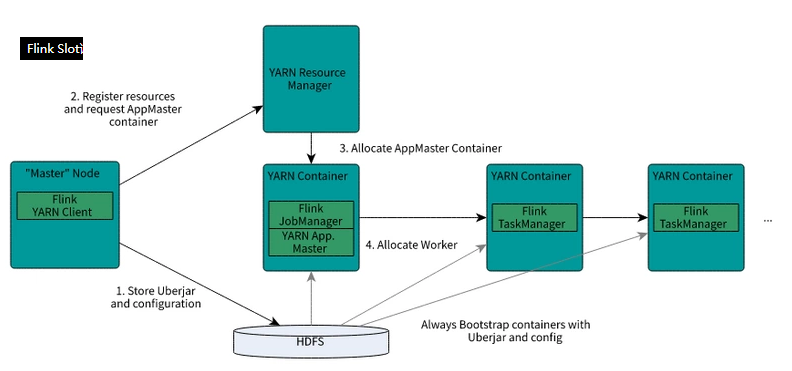
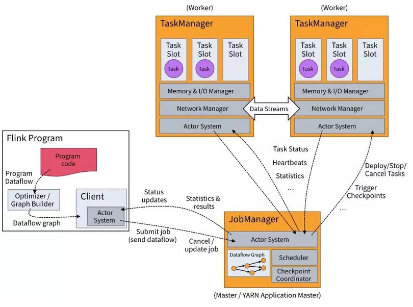
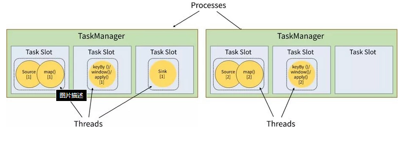
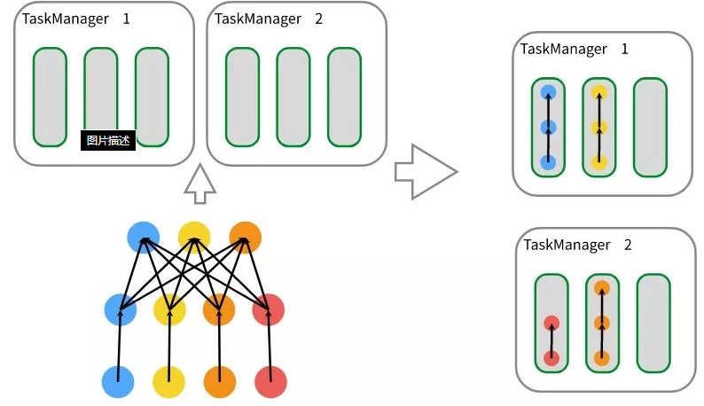
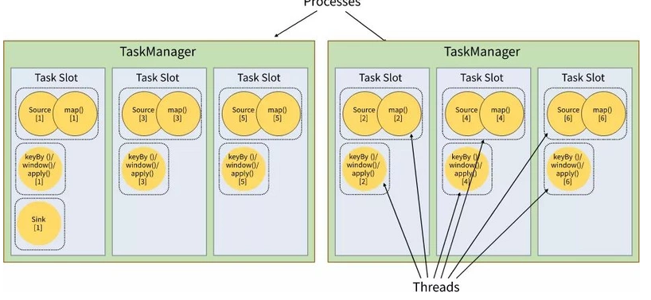
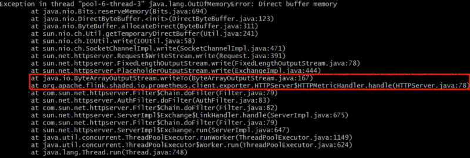

# Flink Slot

Flink 集群是由 JobManager（JM）、TaskManager（TM）、ResourceManager（RM）、dispacher四大组件组成的，每个 JM/TM 都是运行在一个独立的 JVM 进程中。JM相当于 Master，是集群的管理节点，TM相当于 Worker，是集群的工作节点，每个 TM 最少持有 1 个 Slot，Slot 是 Flink 执行 Job 时的最小资源分配单位， 在 Slot 中运行着 具体的 Task 任务。

对 TM 而言：它占用着一定数量的 CPU和 Memory（内存）资源，具体可以通过 `taskmanager.numberOfTaskSlots`，`taskmanager.heap.size` 来配置，实际上 `taskmanager.numberOfTaskSlots` 只是指定 TM 的 Slot 数量， 并不能隔离指定数量的 CPU 给 TM 使用。 在不考虑 Slot Sharing（共享）的情况下，一个 Slot 内运行这个一个 SubTask（Task 实现 Runable，SubTask 是一个执行 Task 的具体实例），所以官方建议 `taskmanager.numberOfTaskSlots` 配置的 Slot 数量和 CPU 相等或成比例。

当然，我们可以借助于 Yarn 等调度系统， 用 Flink On Yarn 的模式来为 Yarn Container 分配指定数量的CPU，以达到较为严格的 CPU 隔离（Yarn 采用 从Cgroup 做基于时间片的资源调度，每个 Container 内运行着一个 JM/TM 实例）。而 `taskmanager.heap.size` 用来配置 TM 的 Memory，如果一个 TM 有 N 个 Slot， 则每个 Slot 分配到的 Memory 大小为整个 TM Memory 的 1/N，同一个 TM 内的 Slots 只有 Memory 隔离，CPU 是共享的。

对于 Job 而言：一个 Job 所需的 Slot 数量大于等于 Operator 配置的最大的 Parallelism（并行度）数，在保持所有 Operator 的 `slotSharingGroup` 一致的前提下 Job 所需的 Slot 数量与 Job 中 Operator 配置的 最大 Parallelism 相等。

关于 TM/Slot 之间的关系可以参考如下从官方文档截取到的三张图：

**图一**：Flink On Yarn 的 Job 提交过程，从图中我们可以了解到每个 JM/TM 实例都属于不同的 Yarn Container， 且每个 Container 内只会有一个 JM 或 TM 实例；通过对 Yarn 的学历我们可以了解到，每个 Container 都是一个独立的进程，一台物理机可以有多个 Container存在（多个进程），每个 Container 都持有一定数量的 CPU 和 Memory 资源， 且是资源隔离的，进程间不共享，这就可以保证同一台机器上的多个 TM 之间 资源是隔离的（Standalone 模式下，同一台机器侠若有多个 TM，是做不到 TM 之间的 CPU 资源隔离）。

**图二**：Flink Job运行图，图中有两个TM，各自有3个Slot，2个Slot内有Task在执行，1个Slot空闲。若这两个TM在不同Container或容器上，则其占用的资源是互相隔离的。在TM内多个Slot间是各自拥有 1/3 TM的Memory，共享TM的CPU、网络（Tcp：ZK、 Akka、Netty服务等）、心跳信息、Flink结构化的数据集等。

**图三：**Task Slot的内部结构图，Slot内运行着具体的Task，它是在线程中执行的Runable对象（每个虚线框代表一个线程），这些Task实例在源码中对应的类是`org.apache.flink.runtime.taskmanager.Task`。每个Task都是由一组Operators Chaining在一起的工作集合，Flink Job的执行过程可看作一张DAG图，Task是DAG图上的顶点（Vertex），顶点之间通过数据传递方式相互链接构成整个Job的Execution Graph。

---

# Operator Chains（任务链）

Operator Chain是指将Job中的Operators按照一定策略（例如：single output operator可以chain在一起）链接起来并放置在一个Task线程中执行。Operator Chain默认开启，可通过`StreamExecutionEnvironment.disableOperatorChaining()`关闭，Flink Operator类似Storm中的Bolt，在Strom中上游Bolt到下游会经过网络上的数据传递，而Flink的Operator Chain将多个Operator链接到一起执行，减少了数据传递/线程切换等环节，降低系统开销的同时增加了资源利用率和Job性能。实际开发过程中需要开发者了解这些原理，并能合理分配Memory和CPU给到每个Task线程。

*注： 【一个需要注意的地方】Chained的Operators之间的数据传递默认需要经过数据的拷贝（例如：kryo.copy(...)），将上游Operator的输出序列化出一个新对象并传递给下游Operator，可以通过ExecutionConfig.enableObjectReuse()开启对象重用，这样就关闭了这层copy操作，可以减少对象序列化开销和GC压力等，具体源码可阅读org.apache.flink.streaming.runtime.tasks.OperatorChain与org.apache.flink.streaming.runtime.tasks.OperatorChain.CopyingChainingOutput。官方建议开发人员在完全了解reuse内部机制后才使用该功能，冒然使用可能会给程序带来bug。*

Operator Chain效果可参考如下官方文档截图：

**图四：**图的上半部分是StreamGraph视角，有Task类别无并行度，如图：Job Runtime时有三种类型的Task，分别是`Source->Map`、`keyBy/window/apply`、`Sink`，其中`Source->Map`是`Source()`和`Map()chaining`在一起的Task；图的下半部分是一个Job Runtime期的实际状态，Job最大的并行度为2，有5个SubTask（即5个执行线程）。若没有Operator Chain，则`Source()`和`Map()`分属不同的Thread，Task线程数会增加到7，线程切换和数据传递开销等较之前有所增加，处理延迟和性能会较之前差。补充：在`slotSharingGroup`用默认或相同组名时，当前Job运行需2个Slot（与Job最大Parallelism相等）。

---

# Slot Sharing（Slot 共享）

Slot Sharing是指，来自同一个Job且拥有相同`slotSharingGroup`（默认：default）名称的不同Task的SubTask之间可以共享一个Slot，这使得一个Slot有机会持有Job的一整条Pipeline，这也是上文提到的在默认slotSharing的条件下Job启动所需的Slot数和Job中Operator的最大parallelism相等的原因。通过Slot Sharing机制可以更进一步提高Job运行性能，在Slot数不变的情况下增加了Operator可设置的最大的并行度，让类似window这种消耗资源的Task以最大的并行度分布在不同TM上，同时像map、filter这种较简单的操作也不会独占Slot资源，降低资源浪费的可能性。

具体Slot Sharing效果可参考如下官方文档截图：

**图五：**图的左下角是一个`soure-map-reduce`模型的Job，source和map是`4 parallelism`，reduce是`3 parallelism`，总计11个SubTask；这个Job最大Parallelism是4，所以将这个Job发布到左侧上面的两个TM上时得到图右侧的运行图，一共占用四个Slot，有三个Slot拥有完整的`source-map-reduce`模型的Pipeline，如右侧图所示；*注：map的结果会shuffle到reduce端，右侧图的箭头只是说Slot内数据Pipline，没画出Job的数据shuffle过程。*

图六：图中包含`source-map[6 parallelism]`、`keyBy/window/apply[6 parallelism]`、`sink[1 parallelism]`三种Task，总计占用了6个Slot；由左向右开始第一个slot内部运行着3个SubTask[3 Thread]，持有Job的一条完整pipeline；剩下5个Slot内分别运行着2个SubTask[2 Thread]，数据最终通过网络传递给`Sink`完成数据处理。

---

# Operator Chain & Slot Sharing API

Flink在默认情况下有策略对Job进行Operator Chain 和 Slot Sharing的控制，比如：将并行度相同且连续的SingleOutputStreamOperator操作chain在一起（chain的条件较苛刻，不止单一输出这一条，具体可阅读`org.apache.flink.streaming.api.graph.StreamingJobGraphGenerator.isChainable(...)）`，Job的所有Task都采用名为default的`slotSharingGroup`做Slot Sharing。但在实际的需求场景中，我们可能会遇到需人为干预Job的Operator Chain 或 Slot Sharing策略的情况，本段就重点关注下用于改变默认Chain 和 Sharing策略的API。

-   StreamExecutionEnvironment.disableOperatorChaining()：关闭整个Job的Operator
    Chain，每个Operator独自占有一个Task，如上图四所描述的Job，如果`disableOperatorChaining`则
    `source->map`会拆开为`source()`,
    `map()`两种Task，Job实际的Task数会增加到7。这个设置会降低Job性能，在非生产环境的测试或profiling时可以借助以更好分析问题，实际生产过程中不建议使用。
-   someStream.filter(...).map(...).startNewChain().map()：`startNewChain()`是指从当前`Operator[map]`开始一个新的chain，即：两个map会chaining在一起而filter不会（因为startNewChain的存在使得第一次map与filter断开了chain）。
-   someStream.map(...).disableChaining()：`disableChaining()`是指当前`Operator[map]`禁用Operator
    Chain，即：Operator[map]会独自占用一个Task。
-   someStream.map(...).slotSharingGroup("name")：默认情况下所有Operator的slotGroup都为`default`，可以通过`slotSharingGroup()`进行自定义，Flink会将拥有相同slotGroup名称的Operators运行在相同Slot内，不同slotGroup名称的Operators运行在其他Slot内。

Operator Chain有三种策略`ALWAYS`、`NEVER`、`HEAD`，详细可查看`org.apache.flink.streaming.api.operators.ChainingStrategy`。`startNewChain()`对应的策略是`ChainingStrategy.HEAD`（StreamOperator的默认策略），`disableChaining()`对应的策略是ChainingStrategy.NEVER，`ALWAYS`是尽可能的将Operators chaining在一起；在通常情况下ALWAYS是效率最高，很多Operator会将默认策略覆盖为`ALWAYS`，如filter、map、flatMap等函数。

---

# 迁移OnYarn后Job性能下降的问题

**JOB说明：**
类似StreamETL，100 parallelism，即：一个流式的ETL Job，不包含window等操作，Job的并行度为100；

**环境说明：**

1.  Standalone下的Job Execution Graph：`10TMs * 10Slots-per-TM`，即：Job的Task运行在10个TM节点上，每个TM上占用10个Slot，每个Slot可用1C2G资源，GCConf： `-XX:+UseG1GC -XX:MaxGCPauseMillis=100`。
2.  OnYarn下初始状态的Job Execution Graph：`100TMs*1Slot-per-TM`，即：Job的Task运行在100个Container上，每个Container上的TM持有1个Slot，每个Container分配`1C2G`资源，GCConf：`-XX:+UseG1GC` `-XX:MaxGCPauseMillis=100`。
3.  OnYarn下调整后的Job Execution Graph：`50TMs*2Slot-per-TM`，即：Job的Task运行在50个Container上，每个Container上的TM持有2个Slot，每个Container分配2C4G资源，GCConfig：`-XX:+UseG1GC` `-XX:MaxGCPauseMillis=100`。

*注：OnYarn下使用了与Standalone一致的GC配置，当前Job在Standalone或OnYarn环境中运行时，YGC、FGC频率基本相同，OnYarn下单个Container的堆内存较小使得单次GC耗时减少。生产环境中大家最好对比下CMS和G1，选择更好的GC策略，当前上下文中暂时认为GC对Job性能影响可忽略不计。*

**问题分析：**
引起Job性能降低的原因不难定位，从这张Container的线程图（VisualVM中的截图）可见：

**图七：**在一个1C2G的Container内有126个活跃线程，守护线程78个。首先，在一个1C2G的Container中运行着126个活跃线程，频繁的线程切换是会经常出现的，这让本来就不充裕的CPU显得更加的匮乏。其次，真正与数据处理相关的线程是红色画笔圈出的14条线程（2条`Kafka Partition Consumer`、Consumers和Operators包含在这个两个线程内；12条`Kafka Producer`线程，将处理好的数据sink到Kafka Topic），这14条线程之外的大多数线程在相同TM、不同Slot间可以共用，比如：ZK-Curator、Dubbo-Client、GC-Thread、Flink-Akka、Flink-Netty、Flink-Metrics等线程，完全可以通过增加TM下Slot数量达到多个SubTask共享的目的。

此时我们会很自然的得出一个解决办法：在Job使用资源不变的情况下，在减少Container数量的同时增加单个Container持有的CPU、Memory、Slot数量，比如上文环境说明中从方案2调整到方案3，实际调整后的Job运行稳定了许多且消费速度与Standalone基本持平。

*注：当前问题是内部迁移类似StreamETL的Job时遇到的，解决方案简单但不具有普适性，对于带有window算子的Job需要更仔细缜密的问题分析。目前Deploy到Yarn集群的Job都配置了JMX/Prometheus两种监控，单个Container下Slot数量越多、每次scrape的数据越多，实际生成环境中需观测是否会影响Job正常运行，在测试时将Container配置为3C6G 3Slot时发现一次java.lang.OutOfMemoryError: Direct buffer memory的异常，初步判断与Prometheus Client相关，可适当调整JVM的MaxDirectMemorySize来解决。*

所出现异常如图八：

---

## 总结

Operator Chain是将多个Operator链接在一起放置在一个Task中，只针对Operator；Slot Sharing是在一个Slot中执行多个Task，针对的是Operator Chain之后的Task。这两种优化都充分利用了计算资源，减少了不必要的开销，提升了Job的运行性能。此外，Operator Chain的源码在streaming包下，只在流处理任务中有这个机制；Slot Sharing在flink-runtime包下，似乎应用更广泛一些（具体还有待考究）。

最后，只有充分的了解Slot、Operator Chain、Slot Sharing是什么，以及各自的作用和相互间的关系，才能编写出优秀的代码并高效的运行在集群上。
